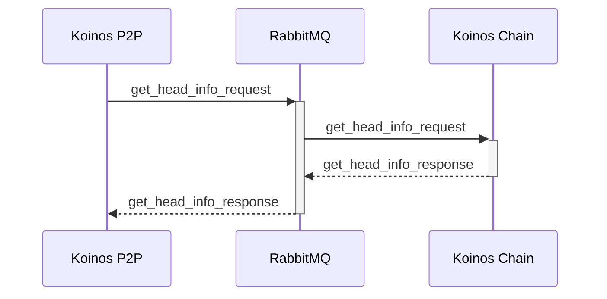
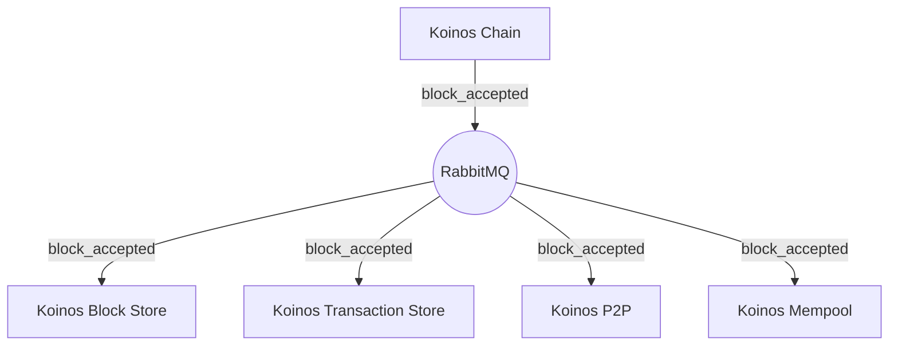

# Interprocess communication

Communication between microservices is accomplished utilizing the AMQP 0.9.1 protocol. The Koinos cluster uses the hub and spoke model. Messages between microservices can either be RPC or broadcast (see **Table 1** below for a more detailed explanation). Messages originating from a particular microservice will be directed through an exchange on RabbitMQ; through `koinos.rpc` and `koinos.event` for RPC and broadcasts, respectively.

> _**Table 1.** A table containing information about the types of messages and exchanges within a Koinos cluster._

|Message type|Exchange|Example request(s)|Characteristics|
|---|---|---|---|
|RPC       |`koinos.rpc`  |`get_head_info` `get_blocks_by_height` `get_account_nonce` `get_chain_id`  |The traditional request/response  model|
|Broadcast |`koinos.event`|`block_accepted` `transaction_accepted` `block_irreversible` `fork_heads`  |An event driven model - messages  are generally sent from one to many|

## RPC

Each microservice that serves RPC requests binds to a durable queue. The system is designed such that each microservice can be scaled up and down based on the load required by the particular Koinos cluster. This is implemented via a competitive consumer model, i.e., multiple instances of a microservice competing to service requests off a single queue.

From a high level, each service makes requests by sending an RPC message to the `koinos.rpc` exchange on the RabbitMQ server. RabbitMQ directs messages from the `koinos.rpc` exchange to the corresponding queue using a routing key. The routing key matches the name of the destination queue. The response messages are matched to the request using a Correlation ID - that is attached to the original request message and the resulting response.

> _**Figure 1.** A diagram demonstrating the data path of an RPC request from Koinos P2P to Koinos Chain._

## Broadcast

When an event occurs within a Koinos cluster, such as when a block is accepted into a fork of the chain, a broadcast message is emitted (as shown in **Figure 2** below). The broadcast message is not directed to any particular consumer, it is intended for any consumer who may be interested. This essentially behaves similar to a publisher/subscriber paradigm where a message is sent on a particular topic.

> _**Figure 2.** A diagram demonstrating the data path of a `block_accepted` message._

The advantage of a broadcast message is that it allows for the loose coupling of services. It also facilitates the seamless integration of user-created microservices. Reacting to the acceptance of a block, for example, will likely be leveraged by most custom applications and does not require RPC or polling.

To receive broadcasts, one must create an anonymous queue and bind it to the `koinos.event` exchange. Using the routing key, one may specify topics of interest. In the case of block acceptance, the corresponding routing key would be `koinos.block.accept`. Wildcards may be used to simplify this process. For example, if an application must be notified about all events involving a block, the routing key can be specified as `koinos.block.*`.
