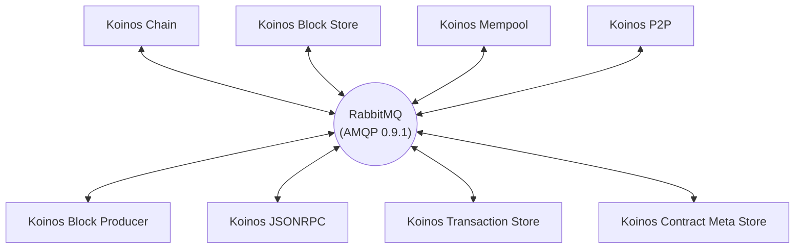

# Microservice architecture

A microservice architecture has many advantages over a more traditional monolithic architecture. By breaking up a complex application into a set of loosely coupled services, software becomes highly maintainable and easily verifiable while providing a great degree of deployment flexibility. Improving or replacing microservices become a trivial task - this allows for low-risk upgrade paths. An additional benefit that should not be underestimated is the ability to choose the programming language best fit for the microservice at hand.

With a microservice architecture, onboarding engineers becomes a more feasible task as engineers can more easily master one or more services without having to understand the details of the larger complicated system. This will lead to more productive hires and higher quality contributions.

## Koinos cluster

The Koinos cluster implements the Koinos protocol leveraging the benefits of microservice architectures. The microservices provided by Koinos Group facilitates all the necessary functions to power the Koinos blockchain (see **Table 1** below for a complete list).

> _**Table 1.** A table containing information about the core microservices of a Koinos cluster._

|Microservice|Language|Responsibilities|
|---|---|---|
|[Koinos Chain](https://github.com/koinos/koinos-chain)                             |C++|Processing blocks and maintaining the state of the chain|
|[Koinos Block Store](https://github.com/koinos/koinos-block-store)                 |Golang|Storing block information|
|[Koinos P2P](https://github.com/koinos/koinos-p2p)                                 |Golang|P2P communication between node clusters|
|[Koinos Mempool](https://github.com/koinos/koinos-mempool)                         |C++|Storing transactions that have yet to be included in blocks|
|[Koinos Transaction Store](https://github.com/koinos/koinos-transaction-store)     |Golang|Storing transaction information|
|[Koinos Block Producer](https://github.com/koinos/koinos-block-producer)           |C++|The production of blocks|
|[Koinos JSON-RPC](https://github.com/koinos/koinos-jsonrpc)                        |Golang|Providing API access from outside the cluster|
|[Koinos Contract Meta Store](https://github.com/koinos/koinos-contract-meta-store) |Golang|Providing ABI data for smart contracts|

Communication between microservices is accomplished by taking advantage of the battle hardened _Advanced Message Queue Protocol_ ([AMQP 0.9.1](https://www.amqp.org/specification/0-9-1/amqp-org-download)) as implemented by [RabbitMQ](https://www.rabbitmq.com/). Each microservice maintains a connection to RabbitMQ which it uses to send and receive _Remote Procedure Calls_ (RPC) as well as broadcast messages. Microservices avoid the need for polling by utilizing broadcast messages in order to implement an event driven paradigm.

> _**Figure 1.** A diagram demonstrating the interprocess communication data flow within a Koinos cluster._

Because of the extensibility of the Koinos cluster, users can develop custom microservices that provide additional functionality. User-created microservices have first class citizenship - in other words, they have the same capabilities of any core microservice provided by Koinos Group. This enables engineers and entrepreneurs to provide unique business propositions that would otherwise be difficult to implement - no longer is polling and parallel data storage required when you have access to the core event driven system.
