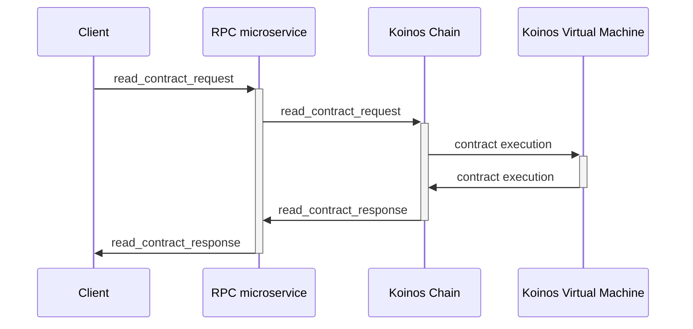
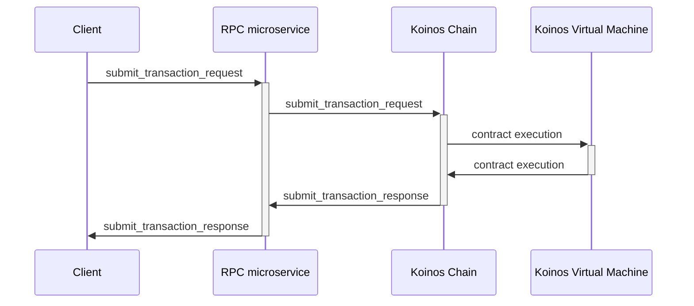
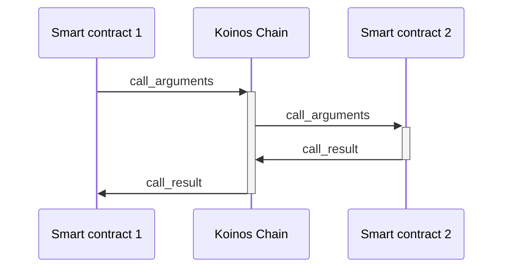

# Smart contracts

The Koinos Blockchain Framework is a bare bones minimal blockchain implementation that is fully customizable through the use of smart contracts. Smart contracts can implement both feature rich
decentralized applications and core system functionality. The information in this documented is intended to be SDK agnostic and explain the core functionality of the Koinos Virtual Machine and its
implementation.

Because Koinos uses [Fizzy](https://github.com/wasmx/fizzy) for its WASM (WebAssembly) virtual machine, the blockchain is agnostic to the language the smart contract has been written -- this allows
support for a multitude of programming languages for development.

Smart contracts come in two flavors: user and system. User contracts have a basic set of features that allow the developer to
write decentralized applications. System contracts have all the features available to user contracts, with the additional ability of access the system contract space.

## Contract space

Each smart contract has access to an `object_space`, which essentially defines a key value store. The `object_space` is defined as follows:

```proto
message object_space {
   bool system = 1;
   bytes zone = 2;
   uint32 id = 3;
}
```

### User space
In the case of a user contract `system` will be set to `false`, the `zone` will be set to the bytes of the public address of the contract, and `id` is used as a unique identifier distinguishing between multiple key value stores. A contract may
have different key value stores by incrementing the `id`.

### System space
The system contract is special in that it may access a _global_ space denoted by `system` being `true` and the `zone` being set to an empty byte array, otherwise known as `kernel` space. This allows for system contracts to read and manipulate a pool
of shared key value stores.

## Entry points

To inform the blockchain which function you are calling within a smart contract an entry point is provided. The Koinos Blockchain Framework will take the request, whether it is a read or write, load up the contract and pass the entry point as a parameter.
The main function will then instantiate the contract class or execute procedurally and execute the corresponding code whether it is a member function or inline code. Entry points come in two flavors: read and write.

### Read-only entry points

Read-only entry points are often used to implement "getter" functions and can be called outside of a transaction. Most commonly, the read only entry points are called using the RPC method `read_contract`. Smart contract code that is executed
in read-only mode is prevented from writing to any key value store. If the contract attempts to perform a write during read-only mode it will be abruptly trapped and a permission denied exception will be thrown.

Given the following RPC request and response definitions:

```proto
message read_contract_request {
   bytes contract_id = 1 [(btype) = CONTRACT_ID];
   uint32 entry_point = 2;
   bytes args = 3;
}
```

```proto
message read_contract_response {
   bytes result = 1;
   repeated string logs = 2;
}
```



> _**Figure 1.** A diagram demonstrating the data path of a `read_contract_request` from an RPC client._

### Writable entry points

Writable entry points have no restrictions with regards to reading or writing data. If the smart contract code attempts to write to a key value store, it must be executed in writable mode. This is accomplished by calling the contract from within
a transaction.

Using the `call_contract_operation` defined below, a user may submit a transaction containing the operation which in turn calls the smart contract in a writable mode.

```proto
message call_contract_operation {
   bytes contract_id = 1 [(btype) = CONTRACT_ID];
   uint32 entry_point = 2;
   bytes args = 3;
}
```

Given the following RPC request and response definitions:

```proto
message submit_transaction_request {
   protocol.transaction transaction = 1;
   bool broadcast = 2;
}
```

```proto
message submit_transaction_response {
   protocol.transaction_receipt receipt = 1;
}
```



> _**Figure 2.** A diagram demonstrating the data path of a `submit_transaction_request` from an RPC client._

## Contract buffers

Because Koinos passes data between the system and contracts using a serialized protocol buffer format, a buffer is used in the interchange of data. There is a cost in CPU cycles when allocating
data within the VM and therefore it costs mana. It is recommended you set your contract buffer to the lowest size possible that will fit both your contract inputs and contract outputs in order to
maintain efficiency with regards to resource usage.

## Intercontract communication

Smart contracts do not necessarily operate in a silo. Any contract has to capability to call upon another contract. This is achieve through a system call, `call`. Similar to both `read_contract` and
`contract_call_operation` it takes similar paremeters and is defined as:

```proto
message call_arguments {
   bytes contract_id = 1 [(btype) = CONTRACT_ID];
   uint32 entry_point = 2;
   bytes args = 3;
}
```

With the corresponding response:

```proto
message call_result {
   bytes value = 1;
}
```

It is up to the developer to serialize the contract input and output data correctly to ensure the integrity of the call between contracts.



> _**Figure 3.** A diagram demonstrating the data path of a smart contract calling another smart contract._
